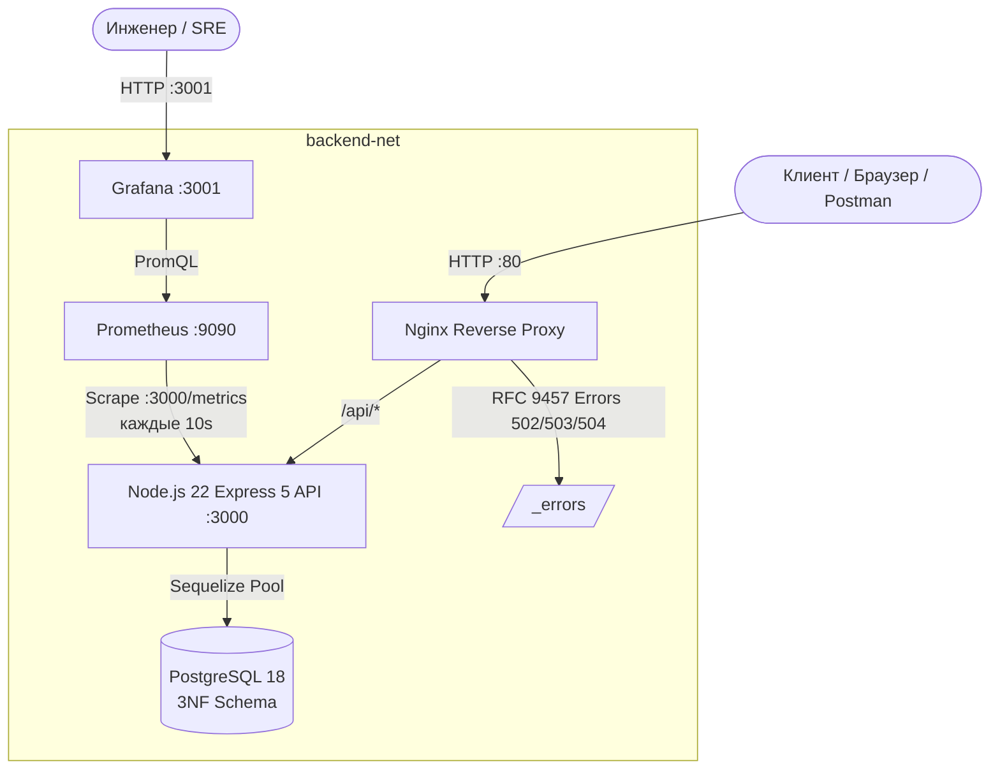

# Equipment Maintenance REST API — Industrial Production Stack

Промышленный отказоустойчивый REST API на **Node.js (Express 5)**, **PostgreSQL 18 (Sequelize ORM)**, **Nginx**, **Prometheus** и **Grafana** для централизованного учёта оборудования возобновляемой энергетики, заявок на техническое обслуживание, назначения ремонтных бригад, прогноза погоды и сквозного мониторинга.

---

## 1. Архитектура системы

Комплекс спроектирован по принципу нулевого доверия и строгой изоляции сетевых контуров. Единственной точкой входа из внешней сети является реверс-прокси Nginx (порт 80). Порты приложения (3000) и СУБД (5432) изолированы во внутренней виртуальной сети Docker (`backend-net`).



---

## 2. Быстрый старт (Zero-Config Deployment)

Все сервисы стека запускаются одной командой. Перед запуском скопируйте шаблон переменных окружения:

```bash
# 1. Скопировать шаблон переменных окружения:
cp .env.example .env

# 2. Запустить весь стек контейнеров:
docker compose up -d
```

### Что происходит автоматически при запуске:
1. Поднимается контейнер **PostgreSQL 18** с healthcheck `pg_isready`.
2. Контейнер **Node.js API** ожидает фактической готовности базы данных через `netcat`-цикл в `docker-entrypoint.sh`.
3. Автоматически накатываются миграции схемы 3NF (`npm run db:migrate`) и сиды демонстрационных данных (`npm run db:seed:all`).
4. Запускаются **Prometheus** и **Grafana** с автоматическим provisioning источников данных, дашбордов и правил алертинга.
5. **Nginx** начинает маршрутизацию клиентского трафика.

### Проверка работоспособности:
```bash
# Проверка статуса контейнеров (все должны быть Up/healthy):
docker compose ps

# Проверка liveness пробы:
curl -i http://localhost/api/health/live

# Проверка readiness пробы (проверка связи с PostgreSQL):
curl -i http://localhost/api/health/ready
```

---

## 3. Переменные окружения

Конфигурация сервиса управляется через файл `.env`. Все основные параметры имеют безопасные значения по умолчанию для локальной разработки:

| Переменная | По умолчанию | Обязательность | Назначение |
|---|---|---|---|
| `PORT` | `3000` | Опционально | Внутренний порт HTTP-сервера Node.js |
| `NODE_ENV` | `development` | Опционально | Окружение выполнения (`development`, `production`, `test`) |
| `CORS_ORIGINS` | `http://localhost,http://127.0.0.1` | Опционально | Разрешенные источники CORS через запятую |
| `COOKIE_SECURE` | `false` | Опционально | Флаг Secure для HttpOnly Refresh Cookie (`false` для HTTP, `true` для HTTPS) |
| `RATE_LIMIT_WINDOW_MS`| `60000` | Опционально | Окно глобального рейт-лимитера (мс) |
| `RATE_LIMIT_MAX` | `100` | Опционально | Максимум запросов в окно на IP |
| `AUTH_RATE_LIMIT_WINDOW_MS` | `900000` | Опционально | Окно защиты от брутфорса аутентификации (15 минут) |
| `AUTH_RATE_LIMIT_MAX` | `10` | Опционально | Максимум попыток логина в окно |
| `JWT_ACCESS_SECRET` | - | Обязательно в prod | 256-битный секретный ключ подписи Access токенов |
| `JWT_REFRESH_SECRET` | - | Обязательно в prod | 256-битный секретный ключ подписи Refresh токенов |
| `JWT_ACCESS_EXPIRES_IN` | `15m` | Опционально | Срок действия Access токена |
| `JWT_REFRESH_EXPIRES_IN` | `7d` | Опционально | Срок действия Refresh токена |
| `POSTGRES_DB` | `equipment_db` | Опционально | Имя базы данных PostgreSQL |
| `POSTGRES_USER` | `app` | Опционально | Пользователь СУБД |
| `POSTGRES_PASSWORD` | - | Обязательно в prod | Пароль пользователя СУБД |
| `DB_POOL_MAX` | `10` | Опционально | Максимальный размер пула соединений Sequelize |
| `DB_POOL_MIN` | `2` | Опционально | Минимальный размер пула соединений Sequelize |
| `DB_POOL_ACQUIRE` | `30000` | Опционально | Таймаут ожидания соединения из пула (мс) |
| `DB_POOL_IDLE` | `10000` | Опционально | Время простоя соединения перед закрытием (мс) |
| `REQUEST_TIMEOUT_MS` | `5000` | Опционально | Таймаут внешних HTTP-запросов (погода) |
| `WEATHER_API_URL` | `https://api.open-meteo.com/v1/forecast` | Опционально | URL внешнего погодного API |
| `WEATHER_MAX_WIND_SPEED` | `12.0` | Опционально | Порог скорости ветра (м/с) для допуска к работам |
| `WEATHER_MAX_PRECIPITATION` | `0.5` | Опционально | Порог осадков (мм) для допуска к работам |
| `LOG_LEVEL` | `info` | Опционально | Уровень логирования Pino (`trace`, `debug`, `info`, `warn`, `error`) |
| `RUN_SEEDS` | `true` | Опционально | Автоматическое наполнение демо-данными при старте |
| `GRAFANA_ADMIN_USER` | `admin` | Опционально | Логин администратора Grafana |
| `GRAFANA_ADMIN_PASSWORD` | `admin` | Опционально | Пароль администратора Grafana |

---

## 4. Точки доступа к сервисам

| Сервис | URL | Назначение |
|---|---|---|
| **API & Gateway** | `http://localhost/api` | Основной программный интерфейс через Nginx |
| **Swagger UI** | `http://localhost/api/docs/` | Интерактивная документация OpenAPI 3.0 с поддержкой Bearer JWT |
| **OpenAPI Spec** | `http://localhost/api/docs/json` | Спецификация OpenAPI 3.0 в формате JSON |
| **Grafana Dashboards** | `http://localhost:3001` | Дашборды мониторинга (логин: `admin`, пароль: `admin`) |
| **Prometheus** | `http://localhost:9090` *(internal)* | Сервер сбора метрик |

---

## 5. Аутентификация, сессии и ролевая модель (RBAC & ABAC)

Сервис реализует двухфакторную модель аутентификации на базе стандартов безопасности OAuth 2.0 / IETF:

- **Access Token**: JWT, время жизни **15 минут**, передается в заголовке `Authorization: Bearer <token>`.
- **Refresh Token**: Криптографически стойкий токен, время жизни **7 дней**, хранится в защищенном `HttpOnly`, `SameSite=Strict` Cookie с путем `/api/auth`. Выбор `SameSite=Strict` обусловлен защитой от CSRF-атак: API и фронтенд работают в рамках одного домена, поэтому кросс-доменная отправка cookie не требуется и должна быть запрещена.
- **Token Rotation & Theft Detection**: При каждом обновлении токена через `POST /api/auth/refresh` старый refresh-токен немедленно инвалидируется в БД. Попытка повторного использования старого токена расценивается как кража — система **мгновенно отзывает все активные сессии пользователя**.
- **Timing-Safe Login**: Защита от перебора логинов по времени ответа (используется dummy-хеш при проверке несуществующих пользователей).

### Матрица ролей и прав доступа:

| Операция | viewer (клиент) | technician (техник) | admin (диспетчер) |
|---|:---:|:---:|:---:|
| Просмотр оборудования (`GET /api/equipment`) | + | + | + |
| Создание / редактирование оборудования | - | - | + |
| Удаление оборудования (`DELETE /api/equipment/:id`) | - | - | + |
| Просмотр заявок (`GET /api/requests`) | + | + | + |
| Создание заявки (`POST /api/requests`) | - | + | + |
| Смена статуса **назначенной** заявки | - | + *(ABAC)* | + |
| Смена статуса **чужой/неназначенной** заявки | - | - *(403 Forbidden)* | + |
| Назначение / снятие бригад (`/assignees`) | - | - | + |
| Удаление заявки (`DELETE /api/requests/:id`) | - | - | + |
| Аналитические отчеты (`/api/reports/*`) | + | + | + |

> **Defense-in-Depth**: Проверка принадлежности заявки технику выполняется на уровне сервисного слоя (`request.service.js`) через связующую сущность `request_assignees`, исключая доступ к чужим задачам даже в обход роутинга.

### Тестовые учетные записи:
- **Администратор**: `admin@energy.local` / `Password123!`
- **Техник**: `technician@energy.local` / `Password123!`
- **Наблюдатель (Viewer)**: `viewer@energy.local` / `Password123!`

---

## 6. Мониторинг, метрики и алертинг

Сервис собирает и экспортирует метрики в формате Prometheus через библиотеку `prom-client`:

### 1. RED Метрики (Request, Error, Duration):
- `http_requests_total` — общее число запросов с лейблами метода, маршрута и HTTP-статуса.
- `http_errors_total` — счетчик ошибок 4xx и 5xx.
- `http_request_duration_seconds` — гистограмма времени ответа сервиса (p50, p95, p99).

### 2. Системные метрики процесса Node.js (USE):
- `nodejs_eventloop_lag_seconds` — задержка Event Loop.
- `nodejs_heap_size_used_bytes`, `process_resident_memory_bytes` — использование оперативной памяти V8 и RSS.
- `process_cpu_user_seconds_total`, `process_cpu_system_seconds_total` — утилизация ядер процессора.
- `nodejs_active_handles_total` — дескрипторы активных сетевых соединений.

### 3. Бизнес-метрики (с дебаунсом 15 секунд):
- `maintenance_requests_total` — количество заявок по статусам (`new`, `in_progress`, `done`, `rejected`) и приоритетам.
- `maintenance_overdue_tasks_total` — количество просроченных регламентных задач.
- `maintenance_mttr_hours` — среднее время закрытия заявок (Mean Time To Repair).
- `maintenance_equipment_total` — количество оборудования с разбивкой по статусам и типам.
- `maintenance_equipment_load_requests` — количество активных заявок в работе на каждую единицу оборудования.

### 4. Дашборды Grafana (авто-провижининг):
1. **Service Observability & Business Dashboard**:
   - Панели SLA, RED метрики (RPS, Error Rate %, Latency p95).
   - Распределение заявок по статусам и уровням критичности.
   - Сводные показатели просрочек и динамика MTTR.
   - Статистика оборудования по типам/статусам и загрузка оборудования (активные заявки в работе).
2. **Node.js Application Runtime**:
   - Мониторинг сборщика мусора V8, утечек памяти, задержки событийного цикла и загрузки CPU.

### 5. Правила алертов:
- **Equipment Maintenance API Down** (`service_down_alert`): срабатывает при падении экземпляра приложения (`app_up == 0`).
- **High 5xx Error Rate (> 5%)** (`high_5xx_error_rate` / `High5xxErrorRate`): срабатывает при превышении доли серверных 5xx ошибок > 5% за скользящее окно 5 минут (`sum(rate(http_errors_total{error_type="5xx"}[5m])) / sum(rate(http_requests_total[5m])) * 100 > 5%`).

---

## 7. Логирование и Graceful Shutdown

1. **Структурированный логгер Pino**:
   - Формат вывода: JSON в production, читаемый цветной текст в development.
   - Сквозной `requestId` (`X-Request-Id`) пробрасывается через контекст `AsyncLocalStorage`.
   - Автоматическое маскирование чувствительных данных (пароли, JWT, cookies).
2. **Синхронизация таймаутов (Zero Dropped Connections)**:
   - Nginx: `keepalive_timeout 60s`.
   - Node.js: `server.keepAliveTimeout = 65000` (65с), `server.headersTimeout = 66000` (66с). Это исключает гонку закрытия TCP-сокетов со стороны Node.js при активном Nginx.
3. **Graceful Shutdown**:
   - При получении `SIGTERM` или `SIGINT` метрика `app_up` немедленно переводится в 0.
   - Новые соединения отклоняются через `server.close()`.
   - Активным запросам дается время на завершение (таймаут 10с).
   - Пул соединений PostgreSQL закрывается корректно (`sequelize.close()`).

---

## 8. Локальный запуск и тестирование

### Запуск тестов:
- **Все тесты (модульные + интеграционные)**:
  ```bash
  npm test
  ```
- **Изолированные модульные тесты бизнес-логики (без БД)**:
  ```bash
  npm run test:unit
  ```
- **Формирование отчёта о покрытии (Coverage Report)**:
  ```bash
  npm run test:coverage
  ```
  *(Генерирует отчёт в консоли и сохраняет HTML/LCOV артефакты в каталоге `coverage/`)*
- **Нагрузочное тестирование (Autocannon / k6)**:
  ```bash
  npm run test:load
  ```
  *(Подробный отчёт с анализом узких мест и графиками: [**docs/LOAD_TESTING_REPORT.md**](./docs/LOAD_TESTING_REPORT.md))*

### Запуск в режиме разработки:
```bash
# 1. Запустить БД в Docker:
docker compose up -d db

# 2. Установить зависимости:
npm install

# 3. Применить миграции и сиды:
npm run db:reset

# 4. Запустить локальный сервер с nodemon:
npm run dev
```

---

## 9. Архитектурные решения и известные ограничения

### 1. Реляционная модель 3НФ и целостность данных
- База данных полностью нормализована до третьей нормальной формы (3НФ): отсутствуют транзитивные функциональные зависимости, дублирование атрибутов и избыточность. Схема разделена на 9 таблиц (`sites`, `equipment`, `equipment_passports`, `technicians`, `maintenance_requests`, `request_assignees`, `request_status_histories`, `users`, `refresh_tokens`).
- Целостность связей обеспечивается на уровне СУБД: каскадное удаление (`CASCADE`) для зависимых дочерних сущностей (паспорт оборудования, история статусов), и защита от случайного удаления (`RESTRICT`) для используемого оборудования.
- Критические операции (перевод статуса заявки с фиксацией в истории, назначение ремонтной бригады с проверкой единственности ведущего инженера, ротация токенов) выполняются строго в транзакциях базы данных.

### 2. Защита аутентификации и сессий (JWT + HttpOnly Cookie)
- Реализована гибридная схема безопасности: короткоживущий Access Token (15 минут) передается в заголовке `Authorization: Bearer <token>`, а криптографически стойкий Refresh Token (7 дней) хранится исключительно в `HttpOnly; SameSite=Strict` Cookie с ограниченным путем `/api/auth`.
- Флаг `COOKIE_SECURE`: по умолчанию отключен (`false`) для корректной работы в тестовых и локальных окружениях по протоколу HTTP (порт 80). При развертывании в защищенном контуре с HTTPS/TLS переключается в `true`.
- Защита от кражи токенов (Theft Detection): при повторной попытке использования уже отозванного или замененного refresh-токена сервер немедленно аннулирует все активные сессии пользователя.

### 3. Синхронизация сетевых таймаутов (Zero Dropped Connections)
- Иерархия таймаутов настроена по отраслевому стандарту: Nginx `keepalive_timeout 60s` < Node.js `server.keepAliveTimeout 65s` < Node.js `server.headersTimeout 66s`.
- Данная конфигурация предотвращает состояние гонки (race condition), при котором Node.js закрывает простаивающее TCP-соединение одновременно с отправкой нового запроса со стороны Nginx, что исключает спорадические ошибки `502 Bad Gateway`.

### 4. Ограничения текущего стенда и векторы масштабирования
- Текущая архитектура представляет собой автономный однонодовый стенд Docker Compose, оптимизированный для надежности, простоты развертывания и полного соответствия техническому заданию (~1000 RPS).
- Направления горизонтального масштабирования для высоконагруженных промышленных сред:
  - **Stateless API Replicas**: горизонтальное масштабирование сервиса `api` (`docker compose up --scale api=N`) с балансировкой через upstream-пул Nginx (`least_conn`).
  - **Пул соединений к СУБД (PgBouncer)**: внедрение легковесного пулера соединений в режиме transaction pooling для масштабирования свыше 100 одновременных подключений к PostgreSQL.
  - **Распределенный кэш (Redis / KeyDB)**: вынос кэширования прогнозов погоды (`WeatherService`), распределенного rate-limiting и дедупликации сессий из памяти отдельных процессов в общий Redis-кластер.
  - **Потоковая репликация PostgreSQL**: разделение путей чтения аналитических отчетов и записи заявок через Read-Replica узлы СУБД.

---

## 10. Эксплуатационный регламент (Runbook)

Подробные пошаговые инструкции для дежурного инженера по действиям в случае аварий (падение PostgreSQL, всплеск ошибок 5xx, переполнение диска, откат миграций схемы) вынесены в отдельный документ:

 [**RUNBOOK.md — Регламент действий при инцидентах**](./RUNBOOK.md)
