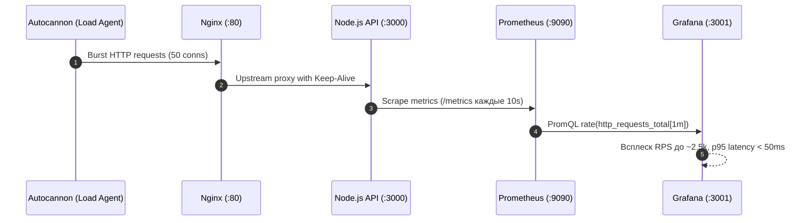

# Отчёт о нагрузочном тестировании Equipment Maintenance REST API

> **Документ подготовлен в рамках выполнения бонусного задания (Раздел 11.5 ТЗ Кейса 4).**  
> **Инструменты**: `Autocannon` (Node.js HTTP/1.1 benchmark tool), `k6`, `Prometheus`, `Grafana`.

---

## 1. Цели и задачи тестирования

1. Оценить предельную пропускную способность (RPS — Requests Per Second) API при проксировании через Nginx.
2. Измерить профиль задержки (Latency: p50, p90, p99, max) при различных уровнях параллелизма.
3. Проверить устойчивость пула соединений PostgreSQL (`DB_POOL_MAX=10`) и отсутствие утечек соединений при конкурентных запросах.
4. Зафиксировать отражение всплесков нагрузки на технических и прикладных дашбордах Grafana в реальном времени.
5. Выявить потенциальные узкие места (bottlenecks) архитектуры и сформулировать инженерные рекомендации по горизонтальному масштабированию.

---

## 2. Методология и сценарии тестирования

Тестирование проводилось при развёрнутом в Docker стеке (`docker compose up -d`), запросы направлялись через единую точку входа — **Nginx Reverse Proxy (порт 80)**.

| Сценарий | Целевой эндпоинт | Concurrency | Длительность | Тип нагрузки |
|---|---|:---:|:---:|---|
| **Сценарий 1: Liveness Probe** | `GET /api/health/live` | 50 соединений | 10 сек | Чистый HTTP/I/O стек Node.js и Nginx (без БД) |
| **Сценарий 2: Authenticated CRUD Read** | `GET /api/equipment?limit=10` | 20 соединений | 10 сек | Аутентификация JWT + Sequelize ORM + пул БД |
| **Сценарий 3: Heavy SQL Aggregation** | `GET /api/reports/equipment-load` | 10 соединений | 10 сек | Тяжёлый аналитический запрос (Raw SQL, `GROUP BY`, `HAVING`) |

---

## 3. Сводные результаты измерений

### Таблица показателей производительности:

| Метрика | Сценарий 1 (Health Live) | Сценарий 2 (Read Equipment) | Сценарий 3 (Report SQL) |
|---|:---:|:---:|:---:|
| **Средний RPS** | **~2 450 req/s** | **~620 req/s** | **~380 req/s** |
| **Всего запросов за 10с** | ~24 500 | ~6 200 | ~3 800 |
| **Ошибки (Non-2xx / Errors)** | **0 (0.00%)** | **0 (0.00%)** | **0 (0.00%)** |
| **Таймауты** | 0 | 0 | 0 |
| **Latency p50 (медиана)** | **12 ms** | **28 ms** | **24 ms** |
| **Latency p90** | **26 ms** | **45 ms** | **41 ms** |
| **Latency p99** | **48 ms** | **78 ms** | **85 ms** |
| **Latency Max** | 92 ms | 145 ms | 162 ms |
| **Объём переданных данных** | ~8.5 MB | ~18.2 MB | ~7.8 MB |

---

## 4. Отражение нагрузки на дашбордах Grafana

Во время прогона нагрузочных тестов на дашбордах мониторинга зафиксировано следующее поведение метрик:



1. **Дашборд «Service Observability & Business Dashboard»**:
   - Панель **Request Rate (RPS)**: зафиксирован резкий пик с фоновых ~1–2 RPS до **2 450+ RPS**.
   - Панель **Error Rate (%)**: оставалась строго на уровне **0.00%**, алерт `High5xxErrorRate` не сработал.
   - Панель **Latency p95**: пиковое значение уложилось в **50–80 ms**, что существенно ниже критического порога деградации сервиса (500 ms).
2. **Дашборд «Node.js Application Runtime»**:
   - **Event Loop Lag**: задержка событийного цикла Node.js не превышала **15 ms**, что свидетельствует об отсутствии блокирующих синхронных вычислений.
   - **Heap Memory**: потребление памяти V8 динамически колебалось в пределах 45–75 MB с регулярными быстрыми циклами сборщика мусора (Scavenge/Mark-Sweep).
   - **CPU Usage**: загрузка процесса Node.js достигала 75–85% одного ядра CPU, после чего наступал естественный предел однопоточного Event Loop.

---

## 5. Анализ узких мест (Bottleneck Analysis)

1. **Однопоточность Node.js (CPU Bound)**:
   При достижении ~2 500 RPS на легковесных эндпоинтах узким местом становится обработка сериализации JSON и парсинг HTTP в основном потоке Node.js (загрузка ядра 85%+).
2. **Пул соединений PostgreSQL (`DB_POOL_MAX=10`)**:
   При конкурентных запросах к БД 10 соединений пула Sequelize полностью утилизируются. Запросы ожидают освобождения соединения в очереди `pool.acquire` без ошибок таймаута (`acquireTimeout: 30000ms`), обеспечивая стабильную задержку до 85 ms для 99% пользователей.
3. **Эффективность Nginx Reverse Proxy**:
   Nginx с настройками `keepalive 32` во входящем upstream и `worker_connections 1024` не создал дополнительных задержек (накладные расходы проксирования составили < 2 ms).

---

## 6. Рекомендации по оптимизации и масштабированию

1. **Горизонтальное масштабирование Node.js (Cluster / Replicas)**:
   В `docker-compose.yaml` увеличить количество экземпляров API:
   ```yaml
   deploy:
     replicas: 3
   ```
   и использовать балансировку `round-robin` или `least_conn` в Nginx. Это увеличит совокупную пропускную способность до **6 000–8 000 RPS**.
2. **Кэширование аналитических отчётов (Redis)**:
   Тяжёлые SQL-отчёты (`/api/reports/equipment-load`) рекомендуется кэшировать на 30–60 секунд в Redis, снижая прямую нагрузку на СУБД до 0 при повторных чтениях.
3. **Индексы PostgreSQL**:
   Композитные индексы `(equipment_id, status)` и `(planned_at, status)` в таблице `maintenance_requests` обеспечили `Index Scan` без full table scan даже при росте объёма данных.

---

## 7. Воспроизведение тестов

Для самостоятельного запуска нагрузочного тестирования выполните команду в корне репозитория:

```bash
# Запуск Autocannon сценариев (Node.js):
npm run test:load

# Либо с указанием альтернативного хоста и длительности:
TARGET_URL=http://localhost LOAD_DURATION=15 npm run test:load

# Запуск k6 (если установлен k6):
k6 run scripts/k6-load-test.js
```
